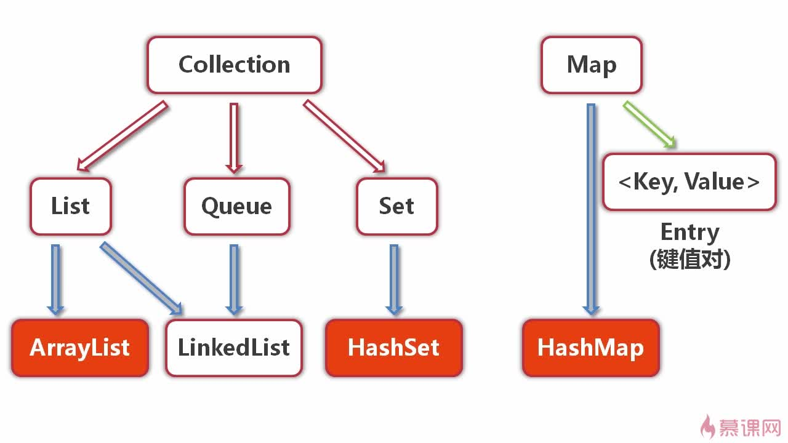

# 集合框架


## 定义

Java中的集合类：是一种工具类，就像是容器，存储任意数量的具有共同属性的对象。

## 作用

集合可以：

1. 在类的内部，对数据进行组织；

2. 简单而快速的搜索大数量的条目；

3. 有的集合接口，提供了一系列排列有序的元素，并且可以在序列中间快速的插入或者删除元素；

4. 有的集合接口，提供了映射关系，可以通过关键字（key）快速的查找到对应的唯一对象，而这个关键字可以是任意类型。

## 与数组的对比

1. 数据的长度固定，集合的长度可变；
2. 数组只能通过下表访问元素，下标类型只能是数字型，而有的集合可以通过任意类型查找所映射的具体对象。

## Java集合框架的体系结构



## Collection接口

1. 是List、Set和Queue接口的父接口；
2. 定义了可用于操作List、Set和Queue的方法——增删改查；

### List接口及其实现类——ArrayList

+ List（序列），元素有序，并且可重复；
+ List可以精确控制元素的插入位置，或删除指定位置的元素；
+ ArrayList——数组序列，是List的一个重要实现类；
+ ArrayList底层是由数组实现的

> 泛型集合中，不能添加泛型规定的类型及其子类型以外的对象，否则会报错。
> 泛型集合中的限定类型，不能使用基本类型，必须用基本类型的包装类。

### Set接口及其实现类——HashSet
+ Set（集），元素无序，并且不可以重复；
+ HashSet——哈希集，是Set的一个重要实现类；

## Map接口

+ Map提供了一种映射关系，元素是以键值对（key-value）的形式存储的，能根据key快速查找value；
+ Map中的键值对以Entry类型的对象实例形式存在；
+ key值不能重复，value值可以重复；
+ key对value是多（一）对一的关系；
+ Map接口提供了返回key值集合、value值集合、Entry值集合，的方法；
+ Map支持泛型，形式如：Map<K,V>

### HashMap类

+ HashMap是Map的一个重要实现类，也是最常用的，基于哈希表实现；
+ HashMap中的Entry对象是无序排列的；
+ Key值和value值都可以为null，但是一个HashMap只能有一个Key值为null的映射（Key值不可重复）；

## 集合的便利

+ ArrayList
    + foreach
    + for循环
    + iterator迭代器

```java

public class Test{
 public static void main(String[] args) {
     List<String> list=new ArrayList<String>();
     list.add("Hello");
     list.add("World");
     list.add("HAHAHAHA");
     //第一种遍历方法使用foreach遍历List
     for (String str : list) {            //也可以改写for(int i=0;i<list.size();i++)这种形式
        System.out.println(str);
     }
 
     //第二种遍历，把链表变为数组相关的内容进行遍历
     String[] strArray=new String[list.size()];
     list.toArray(strArray);
     for(int i=0;i<strArray.length;i++) //这里也可以改写为  foreach(String str:strArray)这种形式
     {
        System.out.println(strArray[i]);
     }
     
    //第三种遍历 使用迭代器进行相关遍历
     
     Iterator<String> ite=list.iterator();
     while(ite.hasNext())//判断下一个元素之后有值
     {
         System.out.println(ite.next());
     }
 }
}
```

+ Map
    + 二次取值法，遍历key/value
    + 迭代器,遍历key/value
    + map.entrySet()方法,遍历key/value
    + map.values()方法，遍历value

```java
public class Test{
     public static void main(String[] args) {
      Map<String, String> map = new HashMap<String, String>();
      map.put("1", "value1");
      map.put("2", "value2");
      map.put("3", "value3");
      
      //第一种：普遍使用，二次取值
      System.out.println("通过Map.keySet遍历key和value：");
      for (String key : map.keySet()) {
       System.out.println("key= "+ key + " and value= " + map.get(key));
      }
      
      //第二种
      System.out.println("通过Map.entrySet使用iterator遍历key和value：");
      Iterator<Map.Entry<String, String>> it = map.entrySet().iterator();
      while (it.hasNext()) {
       Map.Entry<String, String> entry = it.next();
       System.out.println("key= " + entry.getKey() + " and value= " + entry.getValue());
      }
      
      //第三种：推荐，尤其是容量大时
      System.out.println("通过Map.entrySet遍历key和value");
      for (Map.Entry<String, String> entry : map.entrySet()) {
       System.out.println("key= " + entry.getKey() + " and value= " + entry.getValue());
      }
    
      //第四种
      System.out.println("通过Map.values()遍历所有的value，但不能遍历key");
      for (String v : map.values()) {
       System.out.println("value= " + v);
      }
     }
}
```